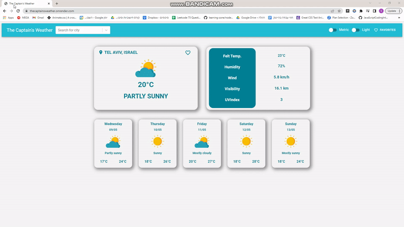

## The Captain's Weather 

Fully responsive Weather app with search functionality, favorites page built with React using AccuWeather API and MUI UI library.

## Project Screen Shot(s)
 

 
 
 
 

## Installation and Setup Instructions

Clone down this repository. You will need `node` and `npm` installed globally on your machine.  

Installation:

`npm install`  

To Start Client:

`npm run dev`

To Visit App:

`localhost:3000`  
